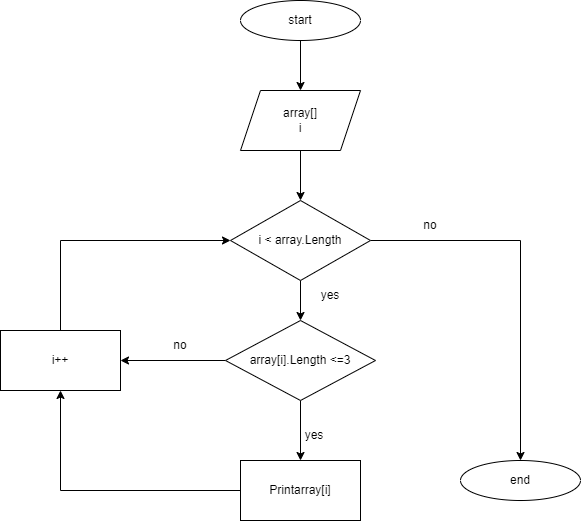

# Описание работы
**Задали массив**

**Определили длину массива**

**Создали три цикла:**

1. *Задали элементы массива с клавиатуры;*
2. *Вывод получившегося массива;*
3. *Проверка элементов массива на условие: если длинна элемента массива меньше или равна трем, то выводи этот элемент.*
